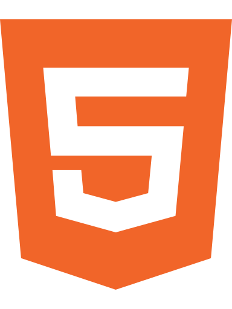

<!DOCTYPE html>

<h1 align="center">David Thai</h1>

[&nbsp;GitHub](https://github.com/dafuloth)&nbsp;&nbsp;&nbsp;&nbsp;[&nbsp;LinkedIn](https://www.linkedin.com/in/dafuloth/)&nbsp;&nbsp;&nbsp;&nbsp;[&nbsp;Codewars](https://www.linkedin.com/in/dafuloth/)&nbsp;&nbsp;&nbsp;&nbsp;[&nbsp;Medium](https://medium.com/@dafuloth)

It's always been my dream to become a developer: I love problem solving, I love computers and technology, and so it's a good fit. Illness forced me to withdraw from my Computer Science degree before I could complete my final year but my determination spurs me on! As a Makers graduate, I'm getting my life back on track and I aim to make my dream a reality.

## Interesting Projects
* TDD, emphasising BDD. Testing frameworks: `RSpec`, `Jasmine`, `pytest`
* Attention to code quality: e.g. `rubocop`, `eslint`, `pylint`
* Integrating with services to track test coverage and code quality: e.g. `Coveralls`, `CodeClimate` 
* CI/CD with `Travis CI` and `Heroku`

<table>
  <tr>
    <td colspan="2" align="left"><em>A journey of learning at Makers:</em></td>
  </tr>

  <tr>
    <td><a href="https://github.com/dafuloth/rps-challenge"><strong>Rock,&nbsp;Paper,&nbsp;Scissors</strong></a> 
      
      
      
       
      
      
    </td>
    <td>
      <ul>
        <li><code>Capybara</code> for front-end feature tests</li>
        <li>Had some fun with <code>HTML5</code> and <code>CSS3</code></li>
        <li>Experimented with <code>Heroku</code>, deploying my app: <strong><a href="https://quiet-wildwood-32600.herokuapp.com/">[demo]</a></strong></li>
      </ul>
    </td>
  </tr>

  <tr>
    <td>
      <a href="https://github.com/dafuloth/bowling-challenge"><strong>Bowling</strong></a> 
      
      
      
      
    </td>
    <td>
      <ul>
        <li>Introduced to <code>JavaScript</code> in Week 5, apply it to a Bowling Scorecard</li>
        <li>Development and debugging using <code>Chrome DevTools</code></li>
      </ul>
    </td>
  </tr>

  <tr>
    <td><a href = "https://github.com/dafuloth/NotesApp"><strong>NotesApp</strong></a> 
      
      
    </td>
    <td>
      A frontend, single page app using only pure JavaScript:
      <ul>
        <li>Pure JavaScript means no frameworks, so no Jasmine!</li>
        <li>So I <a href = "https://github.com/dafuloth/NotesApp/blob/master/spec/assert.js">write my own</a>, understanding that a testing framework's most basic ability is being able to check if an expression evaluates as true.</li>
      </ul>
    </td>
  </tr>

  <tr>
    <td>
      <a href="https://github.com/dafuloth/instagram-challenge"><strong>Instagram Clone</strong></a> 
      
      
       
      
      
      
    </td>
    <td>
      A sandbox for learning, spiking <code>Materialize</code> and <code>Rails</code> experiments:
      <ul>
        <li>Implementation of a CI/CD pipeline.</li>
        <li><code>Travis CI</code> facilitates Continuous Testing</li>
        <li>Automatically deploys to <code>Heroku</code> when tests pass: <strong><a href = "https://dt-instaclonegram.herokuapp.com/">[demo]</a></strong></li>
      </ul>
    </td>
  </tr>

  <tr>
    <td>
      <a href="https://github.com/dafuloth/python_bank"><strong>Bank (Python)</strong></a> 
      
      
      
    </td>
    <td>
      Getting reacquainted with Python via the bank tech test
    </td>
  </tr>
</table>

_Jump to:_ [Education](https://github.com/dafuloth/CV/blob/master/README.md#education) | [More about me](https://github.com/dafuloth/CV/blob/master/README.md#more-about-me) |  [Skills](https://github.com/dafuloth/CV/blob/master/README.md#skills) |  [Experience](https://github.com/dafuloth/CV/blob/master/README.md#experience) | [Interests](https://github.com/dafuloth/CV/blob/master/README.md#other-interests)

## Education

### Makers Academy (January 2019 - April 2019)

- Curious and passionate about code.
- Fast, independent learner
- Great collaborator
- OOP, TDD, MVC, DDD
- Agile/XP
- Ruby, Python, HTML5, CSS3, JavaScript, Rails
- RSpec, Jasmine, Cypress, pytest

### University of Reading

#### DipHE Applied Computer Science
_Withdrew due to illness before I could complete the degree but check out what I got up to in student media:_
  * Wrote and presented **News @ [Junction11](https://www.junction11radio.co.uk)** (student radio station)
  * **Science & Technology Editor** and **Web Editor** at **[Spark*](https://sparknewspaper.co.uk/)**, (student newspaper)
  * Worked with members of **RU:ON TV** (student TV station) to develop story and star in the short film _[This Dead Planet](https://vimeo.com/40466856)_, an entry for the 2012 [Sci-Fi London 48 Hour Film Competition](https://48hour.sci-fi-london.com/)

_...and also the **Microsoft Imagine Cup** - it's like a worldwide code jam for students:_
- [Microsoft Imagine Cup](https://en.wikipedia.org/wiki/Imagine_Cup) 2007 Software Design UK Finals - Theme: _Better Education_- Team Leader
- [Microsoft Imagine Cup](https://en.wikipedia.org/wiki/Imagine_Cup) 2006 Software Design UK Finals - Theme: _Healthier Lives_- Team Member

## More about me

I am passionate about solving real problems and building useful things, using code. Life, health, and circumstances might have had other ideas but software engineering has been a lifelong ambition that I am now making a reality, thanks to the Makers Fellowship programme.

My journey started in primary school with a little pixellated turtle. Moving it around the screen with commands in Logo might not have looked like much but it was the spark that opened my mind to the possibilities of programming, and I've been hooked ever since. From there: QuickBASIC (from the Windows 95 CD-ROM!), Visual Basic, C/C++, C#, Java and now more recently, Ruby and JavaScript. The language may change but the problem-solving thought process is universal.

In a time when 28.8k dial-up internet was common and 56k was bleeding edge, when the web was rather more read-only (compared to what it is now), my interest was in making desktop applications that ran locally - and I dreamed of being a games developer. technology, and my perspective, has evolved a lot since then and my mind is open to the possibilities that now exist: the web is _the_ platform and I want to build web applications - and not necessarily games!

So now I'm looking for my first developer job: if you're a prospective employer looking at this then I would love to discuss with *you* what kind of real problems you want to solve, and what sort of useful things we can build!

## Skills

#### I am proactive

At the first Editors meeting, I enquired why we didn't appear to have a website. Turns out it had gone down some time ago but no one knew why. Furthermore, I was alarmed that one seemed to think it was that important. I think any kind of publication really ought to have website so on my own initiative I offered to investigate and bring it back online.

- It was a WordPress based site. Someone had modified core code and then the site broke when a WordPress update was applied on top
- I should point out that I was not any kind of WordPress expert so this was pure troubleshooting and problem-solving- Fortunately, the database was intact so I was able to create a backup, install WordPress from scratch and then restore all the old posts
- In getting the website back up, I became the new *Web Editor* alongside my existing role. I was responsible for routine maintenance and provided the team with ongoing support so that they could use the website
- Producing that proof-of-concept demonstrated the importance and viability of having a website
- [The website](http://sparknewspaper.co.uk/) lives! They took my MVP, ran with it and now it's looking better than it ever did :grin:

#### I like to write things

At university I did a lot of work with the student newspaper (called _Spark_ or currently, _The Spark_). I started off sending in my submissions but towards the end of my time there, I applied for the soon-to-be vacant position of Science & Technology editor and got the job. In the end there was another great applicant so we shared the job and edited alternate issues.
- I introduced an Editorial column, replacing a column that summarised a few selected news articles, because I thought it was important that we have a dialogue with our readers. And I would still get to write.
- [Here](https://issuu.com/sparkweb/docs/spark_62-3/34) is the final issue we worked on, where we reflected and wrote our farewells. During that time we handled onboarding of the new editor, remaining available to support and mentor.
- Current and earlier issues are available on [Issuu](https://issuu.com/sparkweb)

## Experience

**IKEA Wembley** (2014 to 2018)  
Customer Service Co-worker

_During this gap: Recovering from illness, explored Open University study_

**Oracle Corporation UK Ltd.** (2008)  
QA Engineer - Industrial Placement

## Other Interests

- Writing: Making full use of Markdown for nice GitHub READMEs, and a [Makers Survival Guide](https://blog.makersacademy.com/tagged/makers-survival-guide)
  
- Games: board-, card-, and video-
- (Returning-)Roleplayer and lapsed LARPer.
- Sci-fi and horror
- Formerly: karaoke - a bit out of practice now

***

<em>Acknowledgements:</em>

*GitHub, LinkedIn, and Medium icons from , CC BY 4.0 License - but LinkedIn SVG edited by me to recolour it #0073b1. Codewars icon adapted from [profile badge SVG](https://www.codewars.com/users/dafuloth/badges)*

